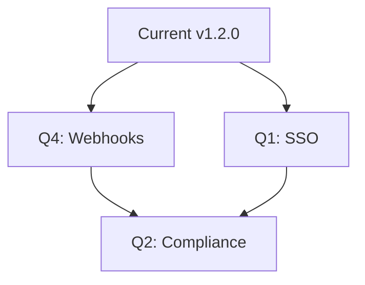

## Recent Updates

<Callout kind="info">
  Cercle Talents releases updates regularly to enhance AI-driven recruitment features, improve performance, and fix issues. Check the [GitHub releases page](https://github.com/cercle-talents/releases) for full details and download links.
</Callout>

<Update label="2024-10-15" description="v1.2.0" tags={["feature", "improvement"]}>

## New Features

- Added AI-powered candidate matching in the Vivier de talents module for better skill-based recommendations.
- Introduced real-time analytics dashboards for tracking recruitment pipelines.

## Improvements

- Enhanced the Assistant IA module with natural language search for candidate sourcing.
- Optimized CV parsing speed by `>30%` for large talent pools.

## Bug Fixes

- Fixed synchronization issues between Gestion clients and Annonces modules.
- Resolved export errors in Veille market trends reports.

</Update>

<Update label="2024-09-20" description="v1.1.0" tags={["feature", "bugfix"]}>

## New Features

- Launched multi-platform job posting integration for major recruitment sites.
- Added customizable pipeline stages in the Sourcing module.

## Bug Fixes

- Corrected authentication token refresh in API endpoints.
- Fixed UI glitches in mobile views for client management.

<Expandable title="Migration Notes" default-open="false">

If you used the legacy API endpoints, update your integrations:

<CodeGroup tabs="JavaScript,Python">
  ```javascript
  // Old endpoint
  fetch('https://api.example.com/v1/candidates');

  // New endpoint (v1.1+)
  fetch('https://api.example.com/v1.1/candidates?include=skills');
  ```
  ```python
  import requests

  # Old endpoint
  response = requests.get('https://api.example.com/v1/candidates')

  # New endpoint (v1.1+)
  response = requests.get('https://api.example.com/v1.1/candidates', params={'include': 'skills'})
  ```
</CodeGroup>

</Expandable>

</Update>

<Update label="2024-08-10" description="v1.0.0" tags={["breaking", "feature"]}>

## Initial Release

- Core Vivier de talents for centralized candidate management.
- Basic Assistant IA for intelligent searches.
- Gestion clients with contact and mandate tracking.

## Breaking Changes

- Deprecated `legacy_cv_upload` endpoint. Migrate to `v1/cv-upload`.

</Update>

## Upcoming Roadmap

<Columns cols={3}>
  <Card title="Q4 2024" icon="zap" href="#roadmap-q4">
    Advanced AI integrations and webhook support.
  </Card>
  <Card title="Q1 2025" icon="trending-up" href="#roadmap-q1">
    Enterprise SSO and custom reporting.
  </Card>
  <Card title="Q2 2025" icon="shield" href="#roadmap-q2">
    Compliance tools and data export enhancements.
  </Card>
</Columns>

<Callout kind="tip">
  Suggest features or report bugs via our [feedback form](https://dashboard.example.com/feedback). Enable auto-updates in your account settings to stay current.
</Callout>

