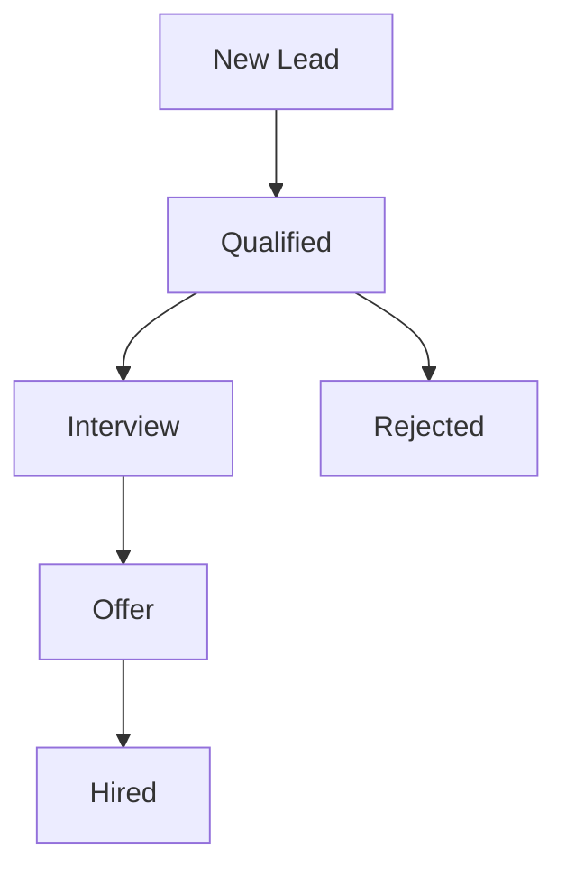

## Overview

Cercle Talents provides essential modules to streamline your recruitment process. You can build talent pools, manage client relationships, leverage AI for matching, post job announcements across platforms, and track sourcing pipelines. These features help automate tasks and improve efficiency.

<Columns cols={3}>
  <Card title="Talent Pool" icon="users" href="#talent-pool">
    Centralize candidate profiles and search by skills.
  </Card>
  <Card title="Client Management" icon="briefcase" href="#client-management">
    Handle contacts and mandates seamlessly.
  </Card>
  <Card title="AI Assistant" icon="zap" href="#ai-assistant">
    Get intelligent candidate recommendations.
  </Card>
</Columns>

## Building and Searching Talent Pools

Maintain a centralized database of candidates in the Vivier de talents module.

<Steps>
  <Step title="Add Candidates" icon="user-plus">
    Upload CVs in bulk or add manually.

    ```
    Supported formats: PDF, DOCX
    ```

    Use the import tool to process resumes automatically.
  </Step>
  <Step title="Tag Skills" icon="tag">
    Assign competencies like `JavaScript`, `React`, `senior-level`.

    The system extracts skills via AI parsing.
  </Step>
  <Step title="Search Pool" icon="search">
    Query by keywords, experience, or location.

    Example: Find `>5 years` in `full-stack development`.
  </Step>
</Steps>

<Callout kind="tip">
  Enable notifications to alert you when new matches enter the pool.
</Callout>

## Managing Clients and Mandates

Organize client contacts and recruitment mandates in the Gestion clients module.

<Tabs>
  <Tab title="Contacts" icon="phone">
    Add client details:

    | Field       | Type     | Required |
    |-------------|----------|----------|
    | Name        | string   | Yes     |
    | Email       | string   | Yes     |
    | Company     | string   | No      |
    | Notes       | text     | No      |

    Link contacts to multiple mandates.
  </Tab>
  <Tab title="Mandates" icon="file-text">
    Create mandates with position details.

    <ParamField path="position" param-type="string" required="true">
      Job title, e.g., "Senior Developer".
    </ParamField>

    <ParamField body="requirements" param-type="array" required="false">
      List of skills: `["React", "Node.js"]`.
    </ParamField>
  </Tab>
</Tabs>

## Using the AI Assistant

The Assistant IA module matches candidates to mandates intelligently.

<Expandable title="How Matching Works" default-open="true">
  Upload a mandate description, and the AI scores candidates from your pool based on skills, experience, and fit.

  ```
  API endpoint: POST https://api.example.com/v1/match
  ```

  <CodeGroup tabs="cURL,JavaScript">
    ```bash
    curl -X POST https://api.example.com/v1/match \
      -H "Authorization: Bearer YOUR_API_KEY" \
      -d '{"mandateId": "mand_123", "topN": 10}'
    ```

    ```javascript
    const response = await fetch('https://api.example.com/v1/match', {
      method: 'POST',
      headers: {
        'Authorization': 'Bearer YOUR_API_KEY',
        'Content-Type': 'application/json'
      },
      body: JSON.stringify({
        mandateId: 'mand_123',
        topN: 10
      })
    });
    const matches = await response.json();
    ```
  </CodeGroup>
</Expandable>

<Callout kind="info">
  Matches include a confidence score from `0.0` to `1.0`.
</Callout>

## Creating Job Announcements

Post jobs to multiple platforms from the Annonces module.

<Steps>
  <Step title="Draft Announcement" icon="edit-3">
    Write title, description, and requirements.
  </Step>
  <Step title="Select Platforms" icon="globe">
    Choose LinkedIn, Indeed, or custom sites.
  </Step>
  <Step title="Publish and Track" icon="eye">
    Monitor views and applications in real-time.
  </Step>
</Steps>

## Tracking Sourcing Pipelines

Visualize candidate journeys in the Sourcing module.



Move candidates between stages and add notes at each step.

## Next Steps

Explore advanced integrations in the Enterprise plan.

<Columns cols={2}>
  <Card title="API Reference" icon="code" href="/authentication">
    Integrate with your systems.
  </Card>
  <Card title="Pricing" icon="dollar-sign" href="/configuration">
    Choose the right plan.
  </Card>
</Columns>